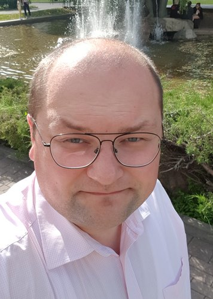

# Yury Kuzmich


##Contact information
To find me | use...
-----------|----------
Mobile number | _+375 44 7495646_
email  | _yurakuzmich@gmail.com_
skype  | _dzenbuddist_

## Summary
For 12+ years have been working as a lawyer for MIA. Today want to become a frontend-developer.
I am ready to learn, open to new knowledge and experience. 
Clever, open-minded, going bald, but still full of desire to code.

## Skills
Have basic web development skills.
For a long time was engaged as a part-time job and a hobby.
**Front:**
 _html, css, js + jquery, bootstrap_.
**Back:**
 _php, mysql, have an understanding of node.js_
Basic knowledge of java.
Worked with engines _(wordpress, joomla, etc)_, rudimentary knowledge of the _codeigniter framework_.
Basic _Photoshop_ skills

#### Code example: 
```
function flyToUser(lng, lat) {
	map.flyTo({center: [lng, lat], zoom:6});
}
```
## Experience
Web development as a part-time job, freelance

## Education
Univercity | startyear | endyear | degree
--------|------|------|-------
Academy of public administration | 2003 | 2008 | specialist
BSEU | 2008 | 2013 | spesialist

## English
Hope It is near to intermediate level.
Anyway finished _Streamline_ english cources


